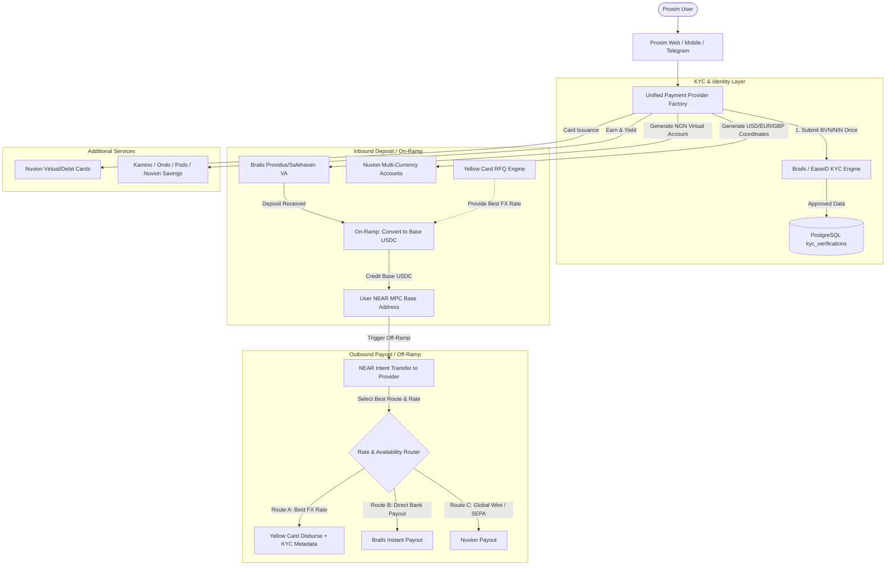

# Proxim Platform Architecture Analysis & Provider Alignment Plan

**Date:** September 2026  
**Document Context:** Technical Analysis of Rails Providers (Brails, Nuvion, Yellow Card), Crypto Infrastructure (NEAR MPC + NEAR Intent), Mobile App Architecture, and Telegram Bot Synchronization.

---

## 1. Executive Summary & Decoding the Directives

Mr. Igboze Israel's directives outline the core operational thesis of Proxim (formerly ZendPay):

1. **The Core Business Model (ZendPay Model)**:
   - **Every Deposit is an On-Ramp**: The user pays in local fiat (e.g., NGN via bank transfer/virtual account). The provider converts this fiat into `USDC` on **Base** and sends it directly to the user's on-chain coordinates.
   - **Every Withdrawal is an Off-Ramp**: When a user withdraws to their local bank, funds move from their on-chain coordinates on Base (via NEAR Intent) to the provider's settlement address. The provider then releases local fiat (NGN) to the destination bank account.
   - **Multi-Chain Access without Gas Friction**: Proxim utilizes a **NEAR Multi-Party Computation (MPC)** relayer account (`NEAR_RELAYER_ACCOUNT_ID`). The relayer sponsors and signs on-chain transactions across Base, Solana, Bitcoin, etc., so the user never pays gas or interacts with technical crypto concepts. This strictly upholds Proxim's **Invisible Crypto Principle**.

2. **The Three Rails Providers & The KYC Problem**:
   - **Brails**: Provides Nigerian virtual accounts (Safehaven / Providus), automated BVN/NIN verification (Tier 1 KYC), NGN card issuing, collection, and payout endpoints.
   - **Nuvion**: International Banking-as-a-Service (BaaS) providing multi-currency accounts (USD, EUR, GBP, NGN, KES), virtual and debit card issuing, business KYB, and yield/savings goals.
   - **Yellow Card**: Leading African crypto-fiat on/off-ramp liquidity rail with the best FX rates via its **Request for Quote (RFQ)** engine.
   - **The Problem**: Brails and Nuvion manage their own user KYC. Yellow Card does not host consumer KYC; it requires the partner (Proxim) to submit verified KYC metadata with transaction requests.
   - **Israel's Question**: How can we combine the providers to get Yellow Card's best rates without making users go through KYC twice, or how can we leverage Brails' KYC approval for Yellow Card?

3. **The Four Key Deliverables Requested**:
   - **Provider Combination Strategy**: How to combine Brails, Nuvion, and Yellow Card.
   - **Crypto Aspect Debugging**: Identify and fix defects in NEAR MPC address derivation, Base USDC funding, gas sponsorship, and NEAR Intent cross-chain execution.
   - **Mobile App Strategy**: How to transition from `apps/mobile-web` to iOS and Android mobile binaries.
   - **Telegram Bot Sync**: Fix user identity duplication, mock transfers, and stale in-memory sessions so the bot stays in sync with the web app and database.

---

## 2. Rails Providers Comparison & Combination Architecture

### 2.1 Provider Capability Matrix

| Feature / Capability | Brails | Nuvion | Yellow Card |
| :--- | :--- | :--- | :--- |
| **Primary Strength** | Nigerian Local Banking & Fast BVN/NIN KYC | Multi-currency BaaS & Cards | Institutional FX Liquidity & Best Rates |
| **KYC Architecture** | Built-in verification (BVN, NIN, Tier 1/2) | Built-in review (Individual & Business KYB) | API KYC Metadata Submission required |
| **Virtual Accounts** | Instant NGN (Safehaven, Providus), USD | Multi-currency (USD, EUR, GBP, NGN, KES) | Virtual Account rails via partner integration |
| **Crypto Settlement** | Stablecoin receive/send | Crypto coordinates | Base USDC, USDT, BTC on/off-ramp via RFQ |
| **FX Conversion** | Standard provider spread | Interbank FX | **Best institutional rates (RFQ with 0 slippage)** |
| **Card Issuance** | Virtual NGN Cards | Virtual & Debit Cards (USD/Local) | Not primary |
| **Savings / Earn** | None | Native Savings Goals | None |

### 2.2 The Solution to the KYC Dilemma (Zero-Double-KYC)

Israel asked: *"If we can return Brails's KYC success and leverage it for Yellow Card, that will be good."*

According to the official [Yellow Card KYC Metadata Documentation](https://docs.yellowcard.engineering/docs/kyc-metadata.md), Yellow Card requires the following metadata for Nigerian transactions:
```json
{
  "name": "Firstname Lastname",
  "country": "NG",
  "phone": "+2348012345678",
  "address": "Street address, City, State",
  "dob": "MM/DD/YYYY",
  "email": "user@example.com",
  "idNumber": "12345678901",       // National Identity Number (NIN)
  "idType": "NIN",
  "additionalIdType": "BVN",
  "additionalIdNumber": "22222222222" // Bank Verification Number (BVN)
}
```
*(Note: Yellow Card explicitly excludes NGN transactions from Tier 0 reduced KYC, making full KYC metadata mandatory).*

**The Exact Solution**:
1. User completes the simple 2-minute Tier 1 KYC flow in Proxim (verified via Brails or EaseID).
2. Proxim validates the BVN and NIN, generating the user's Providus/Safehaven virtual account.
3. Proxim securely persists the verified legal name, date of birth, phone number, address, NIN, and BVN in the `kyc_verifications` table.
4. When executing an On-Ramp, Off-Ramp, or FX conversion with Yellow Card, Proxim's backend automatically maps the stored `kyc_verifications` record into Yellow Card's required KYC metadata payload.
5. **Outcome**: The user undergoes KYC **only once**. Yellow Card receives 100% compliant, pre-verified regulatory data, unlocking Yellow Card's superior FX rates without any user friction.

### 2.3 The Hybrid Multi-Rail Router (`PaymentProviderFactory`)

Instead of picking only one provider, the system should operate as a **Tri-Rail Unified Router**:



- **KYC & Accounts**: Brails handles Tier 1 BVN/NIN for NGN accounts; Nuvion handles multi-currency IBANs.
- **FX Rates & Liquid Conversions**: Yellow Card RFQ Engine acts as the primary liquidity and FX pricing provider.
- **Card Issuing**: Nuvion & Brails handle card provisioning.
- **Yield**: Kamino (Solana), Ondo (EVM), Pods (BSC/EVM), Nuvion (Fiat Earn).

---

## 3. In-Depth Crypto Aspect Audit & Bugs Identified

Israel implemented NEAR MPC address derivation and NEAR Intent 1-Click cross-chain routing. A thorough code inspection of `packages/integrations/src/chainSignaturesBackend.ts`, `packages/integrations/src/nearIntentsClient.ts`, and `apps/backend/src/routes/transfers.ts` revealed several critical bugs:

### Bug 1: Hardcoded Privy ID Check Blocking Non-Privy Users
- **Location**: `apps/backend/src/routes/transfers.ts` (lines 357–358 and 378)
  ```typescript
  const user = (await db.select().from(users).where(eq(users.id, params.entity.userId)).limit(1))[0];
  if (!user?.privyUserId) throw new Error('Entity user has no Privy MPC identity');
  ...
  result = await signAndSubmitTransaction({
    userIdentifier: `privy-${user.privyUserId}`,
    ...
  });
  ```
- **The Issue**: Address derivation in `chainSignaturesBackend.ts` (`buildDerivationPath`) supports any string identifier (e.g., `user.id`, `tg_12345678`, or `privy-did`). However, `fundIntentFromEvm` hardcoded a check demanding `user.privyUserId`.
- **Consequence**: Any user authenticated via email/password, JWT, or the Telegram bot will crash with `Entity user has no Privy MPC identity` whenever they attempt an on-chain transfer or crypto withdrawal.
- **Fix**: Fallback gracefully:
  ```typescript
  const userIdentifier = user.privyUserId ? `privy-${user.privyUserId}` : user.id;
  ```

### Bug 2: Off-Ramp Disconnect Between Bank Payout and On-Chain Intent Transfer
- **Location**: `apps/backend/src/routes/transfers.ts` (`/api/transfers/withdraw`, line 1738)
- **The Issue**: In `/api/transfers/withdraw`, the endpoint immediately triggers `brails.initiatePayout()` from Proxim's Brails fiat float. However, it **does not transfer or burn the corresponding USDC on Base from the user's NEAR MPC address**!
- **Consequence**: The user's on-chain USDC balance remains untouched while fiat money leaves the platform float. This completely breaks the off-ramp invariant where fiat withdrawal must be funded by an on-chain transfer of USDC from the user's MPC address to the settlement account.
- **Fix**: The withdrawal endpoint must execute the two-phase off-ramp:
  1. Initiate the NEAR Intent / MPC transaction to move the required USDC from `entity.evmDepositAddress` to the provider's settlement address.
  2. Upon on-chain confirmation, disburse the fiat via Yellow Card or Brails.

### Bug 3: Hardcoded Static FX Rates Instead of Live RFQ
- **Location**: `apps/backend/src/services/fxQuoteEngine.ts` (lines 22–33)
  ```typescript
  const BASE_FX_RATES: Record<string, number> = {
    NGN: 1 / 1545.0,
    KES: 1 / 129.5,
    ...
  };
  ```
- **The Issue**: The system currently uses static in-memory rates. Yellow Card provides real-time institutional rates via its RFQ API (`POST /rfq`), which guarantees execution with 0 slippage.
- **Fix**: Replace static rates with an active RFQ client that fetches live quotes from Yellow Card, caches them within their validity window, and executes against them.

### Bug 4: Non-Atomic Multi-Leg EVM Signing in chainsig.js
- **Location**: `packages/integrations/src/chainSignaturesBackend.ts` (lines 610–664)
- **The Issue**: Transactions with multiple legs (e.g., user transfer leg + gas top-up or platform fee leg) are submitted iteratively. If leg 1 broadcasts and leg 2 fails, the operation throws an error, leaving the state partially executed on-chain.
- **Fix**: Implement an automated rollback/reconciliation mechanism or combine instructions into an atomic multicall/batch transfer contract call.

---

## 4. Telegram Bot Analysis & Desynchronization Diagnostics

Israel noted: *"Check the telegram build i did and fix so it syncs properly with the app."*

An inspection of `apps/telegram-bot` (`bot.ts`, `liveDataService.ts`, `sessionManager.ts`) revealed the exact reasons why the Telegram bot fails to sync:

### Issue 1: Permanent Account Link Lockout (`409 Conflict`)
- **Location**: `apps/telegram-bot/src/liveDataService.ts` (lines 204–228) vs `apps/backend/src/routes/auth.ts` (lines 389–394)
- **Mechanism**:
  1. When a user interacts with the Telegram bot for the first time without having linked their account first, `liveDataService.getOrCreateUserEntities()` automatically creates a dummy user `tg_<telegramUserId>` in the `users` table and creates a record in `telegram_user_links` with `status: 'linked'`.
  2. Later, when that same user signs into the Proxim Web App and clicks "Link Telegram", the backend generates a nonce and prompts the user to send `/link <nonce>` to the bot.
  3. When `/link <nonce>` is submitted, `routes/auth.ts` inspects `telegram_user_links` for `telegramUserId`:
     ```typescript
     const linkedRows = await db.select().from(telegramUserLinks).where(eq(telegramUserLinks.telegramUserId, telegramUserId)).limit(1);
     if (linkedRows.length > 0 && linkedRows[0].id !== pending.id) {
       return reply.status(409).send({ error: 'This Telegram account is already linked to another user' });
     }
     ```
  4. **The Failure**: Because step 1 already inserted a linked row, step 3 **always throws 409 Conflict**. The user is permanently locked out from ever connecting their web account to their Telegram bot!
- **Fix**:
  - Unlinked bot sessions should be marked with `status: 'unclaimed'` or created as ephemeral guest sessions.
  - The link confirmation flow must support merging/reassigning guest `tg_*` records to the canonical authenticated `user.id`.

### Issue 2: Mock Transfer Execution in the Bot
- **Location**: `apps/telegram-bot/src/bot.ts` (lines 89–94) and `polling.ts` (lines 88–93)
  ```typescript
  if (action?.type === 'TRANSFER') {
    successMsg = `Money sent.\n\nSuccessfully transferred ${action.currency === 'NGN' ? '₦' : '$'}${action.amount.toLocaleString()} to ${action.recipientName}.\nReference: PX-${Date.now().toString().slice(-6)}\n\nYour new available balance is updated.`;
  }
  ```
- **The Issue**: The bot never actually calls the backend API (`/api/transfers/execute` or `/api/transfers/withdraw`). It validates the user's PIN and prints a fake reference number `PX-...`! No money moves, no database ledger entry is written, and the web app obviously reflects zero change.
- **Fix**: Replace mock responses with real authenticated HTTP calls from the bot to the backend transfer execution endpoints.

### Issue 3: Stale In-Memory State (`SessionManager`)
- **Location**: `apps/telegram-bot/src/sessionManager.ts`
- **The Issue**: User session details (balances, active entity, addresses) are stored in an in-memory `Map<number, UserSession>`. When a user deposits funds, modifies their profile, or switches accounts on the web app, the bot's in-memory session retains stale data until an arbitrary 15-minute inactivity timeout.
- **Fix**: Make session state stateless or back it with Redis / direct queries to the database and backend session API.

---

## 5. Mobile App Strategy: From Web App to Native Mobile App

Israel stated: *"See how we can build the mobile app (what i did is webapp)."*

`apps/mobile-web` is currently a single-page React 18 application built with Vite, Tailwind CSS, and Lucide React. It already features a mobile layout with bottom navigation, touch action sheets, and modal flows.

### Recommended Mobile Build Options

#### Option A: Capacitor Native Container (Recommended - 2 to 3 Days to Store Submission)
Instead of rewriting the application in React Native or Flutter, wrap `apps/mobile-web` using **Capacitor 6**:
- **Why this is the best fit**:
  - **100% Code Reuse**: All existing UI components (`NuvionHub`, `BrailsKycModal`, `KycVerificationModal`, `CardsScreen`, `ActivityScreen`) run directly inside the native shell.
  - **Native Hardware Access**:
    - `@capacitor/camera`: Instant photo capture for KYC identity cards and proof of address.
    - `@capacitor/biometrics`: Native Face ID / Touch ID authentication replacing or reinforcing PIN prompts.
    - `@capacitor/push-notifications`: Real-time transaction alert push notifications.
    - `@capacitor/status-bar` and `@capacitor/splash-screen`: Native styling and splash screen experience.
  - **Fast Delivery**: Generates true Xcode (`.xcworkspace`) and Android Studio (`.gradle`) projects capable of publishing to the Apple App Store and Google Play Store.

#### Option B: Progressive Web App (PWA) (Immediate - Same Day Delivery)
- Implement `vite-plugin-pwa` in `apps/mobile-web`.
- Add web app manifest (`display: "standalone"`, icons, theme colors) and service workers for offline caching.
- Users can install Proxim directly from Safari / Chrome ("Add to Home Screen") with zero app store delays.

#### Option C: React Native / Expo (Future Long-Term Option)
- Requires completely rebuilding all HTML/DOM components in React Native primitives (`<View>`, `<Text>`). Not recommended for immediate delivery, as `apps/mobile-web` is already tailored for mobile viewports.

---

## 6. Implementation Roadmap & File Modification Matrix

The updates required across the codebase are grouped into five key areas:

```
┌─────────────────────────────────────────────────────────────────────────────────────────┐
│                               PAYITAPP ARCHITECTURE UPDATES                             │
├─────────────────────────┬───────────────────────────────┬───────────────────────────────┤
│ Domain                  │ Files Affected                │ Key Action Required           │
├─────────────────────────┼───────────────────────────────┼───────────────────────────────┤
│ 1. Yellow Card Client   │ packages/integrations/src/    │ Create YellowCardClient with  │
│    & RFQ Integration    │   yellowCardClient.ts [NEW]   │ RFQ, Quote Accept, and KYC    │
│                         │ packages/integrations/src/    │ metadata formatting.          │
│                         │   providerFactory.ts          │ Connect into provider factory.│
├─────────────────────────┼───────────────────────────────┼───────────────────────────────┤
│ 2. KYC Synergy          │ apps/backend/src/routes/      │ Map stored Brails/EaseID KYC  │
│    (Zero-Double-KYC)    │   kyc.ts                      │ records into Yellow Card's    │
│                         │ apps/backend/src/services/    │ format automatically.         │
│                         │   fxQuoteEngine.ts            │ Replace static rates with RFQ.│
├─────────────────────────┼───────────────────────────────┼───────────────────────────────┤
│ 3. Crypto & MPC Bug     │ apps/backend/src/routes/      │ Remove hardcoded privyUserId; │
│    Fixes                │   transfers.ts                │ wire on-chain Base USDC move  │
│                         │ packages/integrations/src/    │ prior to fiat disbursement.   │
│                         │   chainSignaturesBackend.ts   │ Support non-Privy MPC paths.  │
├─────────────────────────┼───────────────────────────────┼───────────────────────────────┤
│ 4. Telegram Bot         │ apps/telegram-bot/src/        │ Remove dummy user auto-claim; │
│    Sync Fixes           │   liveDataService.ts          │ execute real transfers on     │
│                         │ apps/telegram-bot/src/bot.ts  │ PIN success; sync sessions    │
│                         │ apps/backend/src/routes/      │ with backend DB.              │
│                         │   auth.ts                     │                               │
├─────────────────────────┼───────────────────────────────┼───────────────────────────────┤
│ 5. Mobile App           │ apps/mobile-web/              │ Initialize Capacitor (iOS and │
│    Container            │   capacitor.config.ts [NEW]   │ Android); configure PWA       │
│                         │   package.json                │ manifest and mobile plugins.  │
└─────────────────────────┴───────────────────────────────┴───────────────────────────────┘
```

---

## 7. Conclusion & Recommendation

1. **On Combining Providers**: Do not choose between them—orchestrate them. Use **Brails** for fast BVN/NIN onboarding and local Providus/Safehaven virtual accounts; use **Yellow Card** for best-in-market FX conversion rates and crypto-fiat settlement (leveraging Brails' KYC data so users only verify once); use **Nuvion** for multi-currency international accounts, debit cards, and savings.
2. **On the Crypto Engine**: Fix the `privyUserId` constraint in `transfers.ts` immediately so that all authentication sources (email, JWT, Telegram) can derive their NEAR MPC Base addresses and interact with the NEAR Intent defuser. Ensure off-ramp withdrawals execute the on-chain transfer before releasing float fiat.
3. **On the Telegram Bot**: Eliminate the auto-created linked status for unauthenticated bot users so that web app linking functions properly without `409 Conflict`, and replace mock PIN confirmations with live API execution.
4. **On the Mobile App**: Package `apps/mobile-web` with Capacitor 6. This delivers an App Store and Play Store ready binary in days while maintaining a single codebase.
